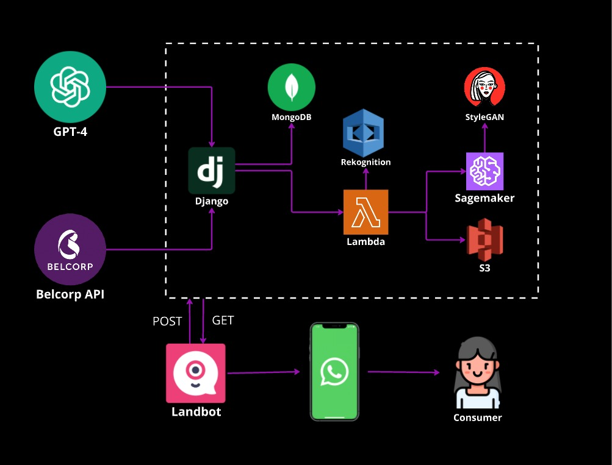

  
  <h3 align="center">Bella Chatbot - Belcorp Hackathon</h3>
  
Grupo 5 · 2024

# Bella

Bella is an artificial intelligence chatbot designed to transform the personalized beauty experience through messaging platforms, such as WhatsApp. This digital assistant allows users to receive beauty product recommendations, facial analysis, and personalized advice without the need for additional apps or augmented reality experiences. Additionally, the Bella API connects users to facial analysis features, allowing clients to virtually try on Belcorp products.

## Table of Contents

- [Bella Chatbot](#bella-chatbot)
  - [Table of Contents](#table-of-contents)
  - [Meet the Team](#meet-the-team)
  - [Features](#features)
  - [Installation](#installation)
    - [Clone the repository](#clone-the-repository)
    - [Install dependencies](#install-dependencies)
    - [Add the Open AI API key](#add-the-open-ai-api-key)
  - [Results](#results)
  - [Software Architecture](#software-architecture)

## Meet the Team

| Members         |
| --------------- |
| Camilla Navinta |
| Leonel Ortega   |
| Lucas Ruiz      |
| Stevens Acha    |
| Oliver Tuesta   |

## Features

- Personalized beauty product recommendations
- Facial analysis
- Customized advice without additional apps
- Easy integration with messaging platforms like WhatsApp
- Empowering experience for the user

## How it works

You have to run both projects:
- Bella Chatbot
- Bella API

When runnning Bella Chatbot, it generaters a QR code. You must open this iamge and scan the QR code inside WhatsApp. Now from the connected phone, it will act as the Chatbot, and when sending messages to it from another device you will be able to interact with Bella.

## Software Architecture

**2024 © Grupo 5 - All rights reserved**
